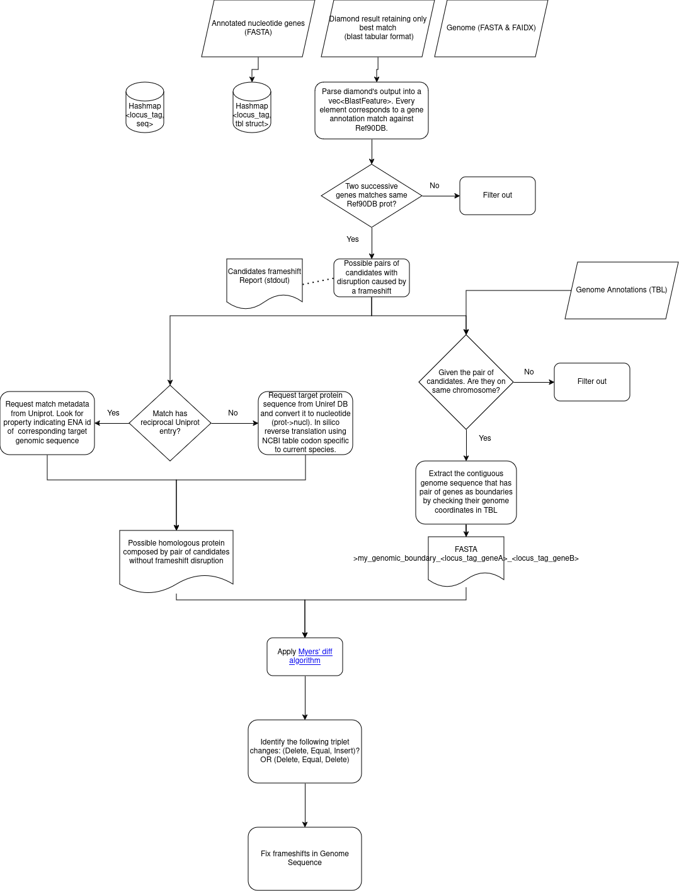

# Rusty-Assemblies (under development - do not use in production)

The main aim of this toolkit is to execute a set of steps to prepare a genome assembly to be ready for submission at GenBank.

## Steps

